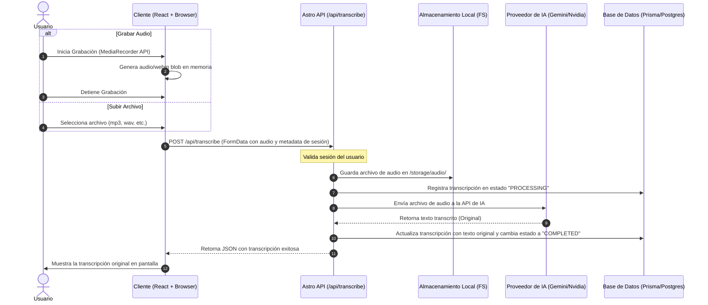

# Arquitectura del Sistema

Este documento describe la arquitectura detallada, el flujo de datos y el diseño del monorepo para la aplicación **AI Audio Transcriber & Translator**.

---

## 1. Diseño del Monorepo (pnpm Workspaces)

El monorepo utiliza `pnpm` workspaces para gestionar dependencias de forma eficiente, permitiendo compartir código TypeScript (como el cliente de la base de datos y los adaptadores de IA) entre la aplicación web y cualquier servicio futuro.

### Configuración de Raíz (`/package.json`)
```json
{
  "name": "transcriber-monorepo",
  "private": true,
  "engines": {
    "node": ">=18.0.0"
  },
  "scripts": {
    "dev": "turbo run dev",
    "build": "turbo run build",
    "lint": "turbo run lint",
    "db:generate": "pnpm --filter database db:generate",
    "db:migrate": "pnpm --filter database db:migrate"
  },
  "devDependencies": {
    "turbo": "^1.10.0"
  }
}
```

### Espacio de Trabajo (`/pnpm-workspace.yaml`)
```yaml
packages:
  - 'apps/*'
  - 'packages/*'
```

---

## 2. Diagrama de Arquitectura

El siguiente diagrama de flujo ilustra cómo interactúan los diferentes componentes del sistema:

```mermaid
graph TD
    %% Componentes Frontend/Backend
    subgraph Client ["Cliente (Browser)"]
        UI["Astro React UI (Grabación/Subida)"]
        AuthForm["Formulario de Login/Registro"]
    end

    subgraph Backend ["Servidor Astro (SSR)"]
        API["Endpoints de API (Astro Pages/API)"]
        Storage["Almacenamiento Local (FS)"]
        Cleaner["Script de Limpieza (Cron Job)"]
    end

    subgraph Packages ["Paquetes Compartidos"]
        PrismaPkg["@transcriber/database (Prisma Client)"]
        AISvcPkg["@transcriber/ai-services (AI Adapters)"]
    end

    subgraph External ["Servicios Externos"]
        DB[(PostgreSQL)]
        GeminiAPI["Google Gemini API"]
        NvidiaAPI["NVIDIA NIM API"]
        OpenRouterAPI["OpenRouter API"]
    end

    %% Flujos de Información
    UI -->|1. Envía Audio (Upload/Stream)| API
    AuthForm -->|Autenticación| API
    
    API -->|2. Guarda Audio| Storage
    API -->|3. Registra Metadata| PrismaPkg
    API -->|4. Llama a Transcribir/Traducir| AISvcPkg
    
    PrismaPkg -->|Lectura/Escritura| DB
    AISvcPkg -->|5. Procesa Audio/Texto| GeminiAPI
    AISvcPkg -->|5. Alternativa Transcripción| NvidiaAPI
    AISvcPkg -->|5. Traducción Alternativa| OpenRouterAPI
    
    Cleaner -->|Borra archivos antiguos (> X días)| Storage
```

---

## 3. Flujo de Audio (Grabación y Carga)

El sistema soporta dos métodos para obtener audio: **carga de archivos** y **grabación en vivo**.



### 3.1. Grabación de Audio (Cliente Web)
La grabación en el cliente se realiza utilizando la API `MediaRecorder` del navegador:
1. Solicitar permisos al usuario mediante `navigator.mediaDevices.getUserMedia({ audio: true })`.
2. Registrar chunks de datos de audio (`dataavailable` event).
3. Exportar un archivo `audio/webm` o `audio/wav` como un `Blob`.
4. Enviar el blob encapsulado en un objeto `FormData` a la API del backend.

### 3.2. Carga y Procesamiento en Astro
El backend de Astro (que corre en modo SSR) procesa la petición multipart:
1. Extrae el archivo binario.
2. Genera un nombre de archivo único utilizando UUID para evitar colisiones: `${userId}_${sessionId}_${Date.now()}.webm`.
3. Guarda el archivo en el directorio configurado `AUDIO_STORAGE_PATH` (ej. `storage/audio/`).

---

## 4. Estrategia de Almacenamiento Local y Limpieza Automática

Para evitar saturar el disco duro del servidor con audios antiguos, implementamos un esquema de retención temporal configurable.

### Reglas de Retención
* Los metadatos de las transcripciones y traducciones **se guardan permanentemente** en PostgreSQL.
* Los archivos físicos de audio en el servidor se borran automáticamente después de **X días** (definido en las configuraciones del administrador).

### Script de Limpieza Automática (`/scripts/clean-audio.js`)
Este script se ejecuta periódicamente (a través de un Cron Job de Linux o un programador de tareas en Windows).

```javascript
import fs from 'fs';
import path from 'path';
import { PrismaClient } from '@prisma/client';

const prisma = new PrismaClient();

async function cleanExpiredAudio() {
  // 1. Obtener la retención configurada (por defecto 7 días si no está definida)
  const retentionConfig = await prisma.adminSetting.findUnique({
    where: { key: 'audio_retention_days' }
  });
  const days = retentionConfig ? parseInt(retentionConfig.value) : 7;
  const expirationThreshold = new Date();
  expirationThreshold.setDate(expirationThreshold.getDate() - days);

  console.log(`Buscando archivos de audio anteriores al: ${expirationThreshold.toISOString()}`);

  const storageDir = process.env.AUDIO_STORAGE_PATH || './storage/audio';

  // 2. Leer el directorio de almacenamiento
  fs.readdir(storageDir, (err, files) => {
    if (err) {
      console.error("Error leyendo directorio de audios:", err);
      return;
    }

    files.forEach(file => {
      const filePath = path.join(storageDir, file);
      
      // Obtener estadísticas del archivo
      fs.stat(filePath, async (err, stats) => {
        if (err) {
          console.error(`Error obteniendo stats del archivo ${file}:`, err);
          return;
        }

        // Si el archivo es más viejo que el límite de retención
        if (stats.mtime < expirationThreshold) {
          fs.unlink(filePath, (err) => {
            if (err) {
              console.error(`Error eliminando archivo ${file}:`, err);
            } else {
              console.log(`Archivo eliminado por expiración: ${file}`);
            }
          });
        }
      });
    });
  });
}

cleanExpiredAudio()
  .catch(console.error)
  .finally(() => prisma.$disconnect());
```

---

## 5. Gestión de Sesiones y Traducción

* **Sesiones de Transcripción**: Un usuario puede agrupar múltiples audios dentro de una "Sesión de Transcripción" (ej. "Reunión de Marketing").
* **Traducción**: Una vez completada la transcripción original, el usuario puede solicitar traducciones bajo demanda. La traducción lee el texto original almacenado en la base de datos y realiza una solicitud liviana de LLM al proveedor de IA, evitando reprocesar el archivo de audio.
